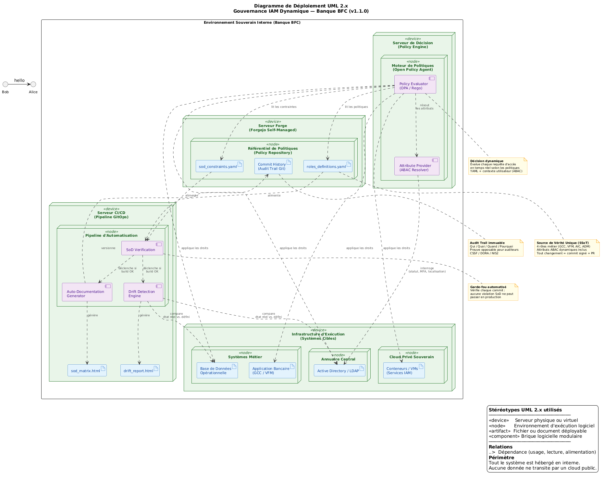

# 🛡️ Gouvernance IAM Dynamique — Projet BFC

**Version :** 1.0.0  
**Date :** 2026-06-26  
**Auteur :** Arnaud Montcho — Consultant IAM / Gouvernance  
**Licence :** MIT (libre d'utilisation et de modification)  

---

## 📖 Qu'est-ce que ce projet ?

Ce dépôt contient un **squelette fonctionnel** de gouvernance des accès pour une banque fictive nommée **BFC**. Il démontre comment transformer une gouvernance IAM statique (Excel, Word, documents obsolètes) en une **gouvernance dynamique, auto-documentée et auditable**.

### Le problème que cela résout

Dans la plupart des banques, la matrice des accès est un fichier Excel mis à jour manuellement une fois par an. Le lendemain de sa validation, elle est déjà obsolète. Ce projet montre comment :

1. **Définir les rôles** dans des fichiers texte structurés (YAML) — versionnables, traçables
2. **Détecter automatiquement** les violations de séparation des tâches (SoD)
3. **Générer** une matrice de conformité à jour en un clic

### Ce que contient ce dépôt

```
📁 iam-governance-policy-as-code/
├── README.md
├── fiche_reglementaire.md
├── policies/
│   ├── roles_definitions.yaml
│   └── sod_constraints.yaml
├── scripts/
│   ├── generate_matrix.py
│   └── drift_detector.py
├── diagrams/
│   └── architecture_deployment.puml
└── reports/          ← dans .gitignore
```

---

## 🎯 Pour qui est-ce fait ?

| Profil | Ce que ce projet lui apporte |
|--------|------------------------------|
| **Consultant IAM** | Un modèle reproductible pour démontrer la valeur du Policy-as-Code à ses clients |
| **RSSI / Responsable Conformité** | Une preuve de concept montrant que la conformité peut être automatisée sans licence coûteuse |
| **Auditeur interne** | Un exemple de "Source de Vérité Unique" traçable et reproductible |
| **Architecte IAM** | Un squelette technique pour industrialiser la gouvernance des accès |

---

## 🏗️ Architecture de la solution



> **Lecture du schéma :** de gauche à droite — la Forge souveraine (source de vérité) alimente le Pipeline CI/CD (automatisation), qui pousse les politiques validées vers le Moteur de Décision (OPA), qui enforce les droits sur les Systèmes Cibles (AD, BDD, App).

---

## 🚀 Comment l'utiliser (3 étapes)

### Étape 1 : Préparer l'environnement

Tu as besoin de **Python 3.8+** et de la bibliothèque `PyYAML`.

```bash
# Vérifier que Python est installé
python --version

# Installer PyYAML (une seule fois)
pip install pyyaml
```

> **Pourquoi Python ?** C'est un langage lisible. Même sans être développeur, tu peux comprendre la logique du script. Chaque ligne est commentée.

### Étape 2 : Lancer le générateur

```bash
python generate_matrix.py
```

Le script va :
1. Lire `roles_definitions.yaml` (les rôles)
2. Lire `sod_constraints.yaml` (les règles SoD)
3. Construire la matrice de compatibilité
4. Générer 3 rapports : HTML, Markdown, et texte

### Étape 3 : Consulter les résultats

- **Ouvre `sod_matrix.html`** dans ton navigateur (Chrome, Firefox, Edge). Tu verras un tableau coloré avec les incompatibilités en rouge.
- **Ouvre `sod_matrix.md`** dans n'importe quel éditeur de texte. C'est le format "universel" que tu peux copier-coller dans Word.
- **Ouvre `sod_report.txt`** pour un résumé en 30 secondes.

---

## 🧠 Les concepts clés (expliqués pour un non-technique)

### RBAC vs ABAC : la différence fondamentale

| | **RBAC** (Role-Based) | **ABAC** (Attribute-Based) |
|---|---|---|
| **Question** | "Qui es-tu ?" | "Qui es-tu, OÙ es-tu, QUAND le fais-tu ?" |
| **Exemple** | "Tu es GCC, donc tu peux consulter les comptes" | "Tu es GCC, MAIS tu es dans un café à 23h → ACCÈS REFUSÉ" |
| **Statique / Dynamique** | Statique (une fois défini, ça ne change pas) | Dynamique (évalué à chaque requête) |
| **Analogie** | Ton badge d'accès (tu l'as ou tu ne l'as pas) | Ton badge + un détecteur de mouvement (il vérifie où et quand tu passes) |

**Ce projet utilise les DEUX.** Le RBAC définit le "quoi" (les permissions). L'ABAC définit le "contexte" (où, quand, comment). Cela réduit drastiquement le nombre de rôles à gérer.

### Séparation des Tâches (SoD)

Le principe : **personne ne peut cumuler deux fonctions incompatibles.**

Exemple concret : si tu crées un virement de 500 000€, tu ne peux pas aussi le valider. Il faut un deuxième œil ("Four-Eyes principle"). C'est une exigence de DORA (Art. 5 + Art. 9) et de la CSSF Circ. 12/552 point 45.

Dans ce projet, les règles SoD sont définies dans `sod_constraints.yaml`. Le script les vérifie automatiquement. Si une personne a deux rôles incompatibles, le système le détecte et le signale.

### Source de Vérité Unique (SSoT)

C'est le principe qu'il n'y a **qu'un seul endroit** où la vérité est écrite. Ici, c'est `roles_definitions.yaml`. Tout le reste (rapports, matrices, audits) est **généré** à partir de ce fichier. Si la vérité change, les rapports suivent automatiquement.

**Avantage :** tu ne peux plus avoir un document Word qui dit une chose et un Excel qui dit l'inverse. La source est unique.

### GitOps et traçabilité

Chaque modification des fichiers YAML est :
- **Datée** (quand ?)
- **Identifiée** (qui ?)
- **Justifiée** (pourquoi ?)
- **Validée par un pair** (Four-Eyes sur le code)

Pour un auditeur, c'est le paradis. Il peut remonter l'historique complet de chaque changement de rôle, sans jamais demander à un humain "qui a fait ça ?".

---

## 🏦 Les 4 rôles de la banque BFC

| Rôle | Code | Métier | Niveau de sensibilité |
|------|------|--------|----------------------|
| Gestionnaire de Comptes Clients | GCC | Ouvre, modifie, consulte les comptes | Standard |
| Validateur de Flux Monétaires | VFM | Valide les virements > 10 000€ | Élevé |
| Auditeur Interne Conformité | AIC | Consulte les logs et les rapports | Élevé |
| Administrateur IAM | ADM | Gère les rôles et les politiques | CRITIQUE |

Chaque rôle a des **attributs ABAC** qui restreignent dynamiquement l'accès selon le contexte (localisation, heure, statut du collaborateur, MFA, PAM).

---

## ⚠️ Limites et prérequis (lecture honnête)

Ce projet est un **squelette de démonstration**. Il ne prétend pas remplacer un outil d'IGA (SailPoint, One Identity) dans un environnement de production. Voici les limites réelles :

### 1. Environnements legacy

Ce projet utilise des fichiers YAML et un script Python. Dans une banque traditionnelle française, les systèmes cibles sont souvent :
- **Active Directory / LDAP** (annuaire central)
- **RACF / Top Secret** (mainframe IBM)
- **CA Identity Manager / Evidian** (IAM legacy)

**Ces outils ne parlent pas nativement YAML.** Il faudra développer des **connecteurs** (scripts d'export) qui traduisent les fichiers YAML vers les formats compris par ces systèmes. C'est faisable, mais c'est du travail supplémentaire.

### 2. Boucle de rétroaction (drift detection)

Ce projet détecte les incompatibilités entre rôles, mais il ne détecte pas encore les **dérives réelles** dans les systèmes cibles. Par exemple : si un administrateur modifie directement un droit dans Active Directory sans passer par le YAML, le projet ne le saura pas.

**Pour compléter :** il faudrait ajouter un module de "drift detection" qui compare régulièrement l'état réel des systèmes (via API) avec l'état défini dans les YAML. C'est l'étape suivante.

### 3. Échelle industrielle

Avec 4 rôles, tout est simple. Dans une vraie banque, on compte en **centaines de rôles** et **milliers de permissions**. Le format YAML reste viable, mais il faut :
- Une structure de dossiers plus granulaire (un fichier par département)
- Un moteur de décision plus performant (OPA/Rego au lieu de Python pur)
- Une base de données pour stocker les logs d'audit (pas un fichier texte)

### 4. Souveraineté

Ce projet est conçu pour être **auto-hébergé** (Forgejo, GitLab interne). Il ne dépend pas de GitHub public. C'est un point clé pour les banques soumises au Cloud Act américain.

---

## 📚 Glossaire (FR/EN)

| Terme français | Terme anglais | Définition simple |
|----------------|---------------|-------------------|
| **RBAC** | Role-Based Access Control | Contrôle d'accès basé sur les rôles. Tu as un badge = tu as des droits. |
| **ABAC** | Attribute-Based Access Control | Contrôle d'accès basé sur les attributs. Ton badge + où tu es + quand tu es là = droits ajustés. |
| **SoD** | Separation of Duties | Séparation des tâches. Tu ne peux pas cumuler deux fonctions incompatibles. |
| **Policy-as-Code** | Policy-as-Code | Les règles de sécurité sont écrites comme du code (texte structuré), pas comme des documents Word. |
| **GitOps** | GitOps | La gestion des infrastructures et des politiques via Git. Chaque changement est versionné et traçable. |
| **SSoT** | Single Source of Truth | Source de vérité unique. Un seul endroit où la vérité est écrite. Tout le reste en découle. |
| **Four-Eyes** | Four-Eyes Principle | Principe du double contrôle. Deux personnes doivent valider une action critique. |
| **MFA** | Multi-Factor Authentication | Authentification forte (mot de passe + code SMS + biométrie). |
| **PAM** | Privileged Access Management | Gestion des accès privilégiés. Les sessions admin sont enregistrées et supervisées. |
| **Drift** | Drift | Dérive. Quand la réalité des systèmes s'écarte de la configuration définie. |
| **IGA** | Identity Governance and Administration | Gouvernance et administration des identités. Les outils type SailPoint, One Identity. |
| **IAM** | Identity and Access Management | Gestion des identités et des accès. Le domaine global. |
| **DORA** | Digital Operational Resilience Act | Directive européenne sur la résilience opérationnelle numérique (applicable aux banques). |
| **NIS2** | Network and Information Security 2 | Directive européenne sur la sécurité des réseaux et de l'information (v2). |
| **CSSF** | Commission de Surveillance du Secteur Financier | Régulateur du Luxembourg. Sa circulaire 12/552 impose la séparation des fonctions. |
| **PoLP** | Principle of Least Privilege | Principe du moindre privilège. On donne le minimum de droits nécessaires. |
| **YAML** | YAML Ain't Markup Language | Format de fichier texte structuré, lisible par humains et machines. |
| **OPA** | Open Policy Agent | Moteur de décision open-source pour le Policy-as-Code (langage Rego). |
| **CI/CD** | Continuous Integration / Continuous Deployment | Pipeline d'automatisation qui teste et déploie les changements automatiquement. |

---

## 🔗 Prochaines étapes

1. **Connecteurs legacy** — Synchronisation vers Active Directory / LDAP via API
2. **Pipeline CI/CD complet** — GitHub Actions ou GitLab CI pour automatiser les tests SoD à chaque commit
3. **Drift detection temps réel** — Comparaison continue état réel vs. état défini via API Graph
---

## 📝 Comment citer ce projet

```
Arnaud Montcho, "Gouvernance IAM Dynamique — Squelette Policy-as-Code pour banque",
Projet BFC, v1.0.0, 2026.
```

---

*Ce projet est conçu pour être compris, modifié et amélioré. Chaque ligne de code est commentée. Chaque choix est justifié. La gouvernance ne doit pas être une boîte noire.*
